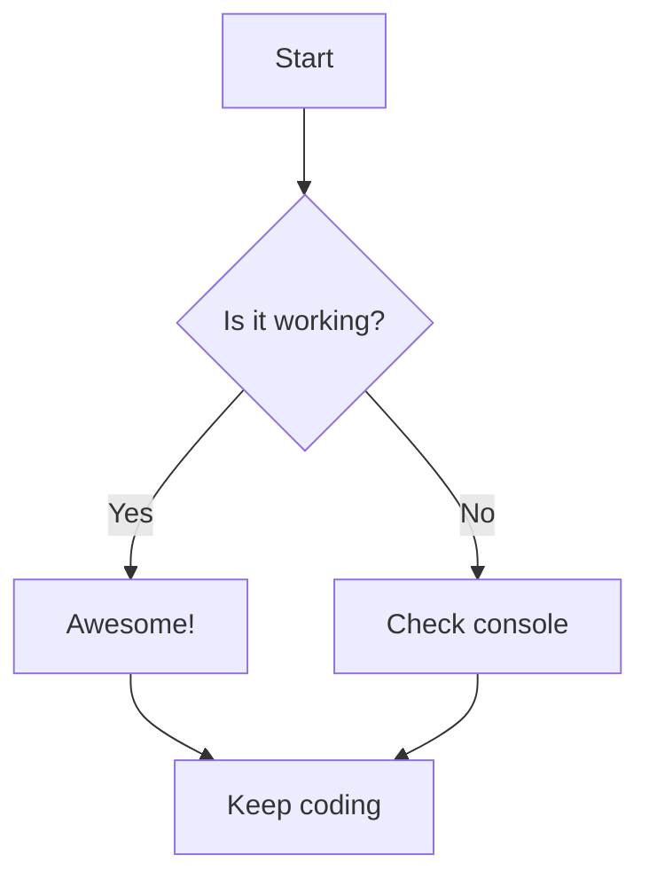
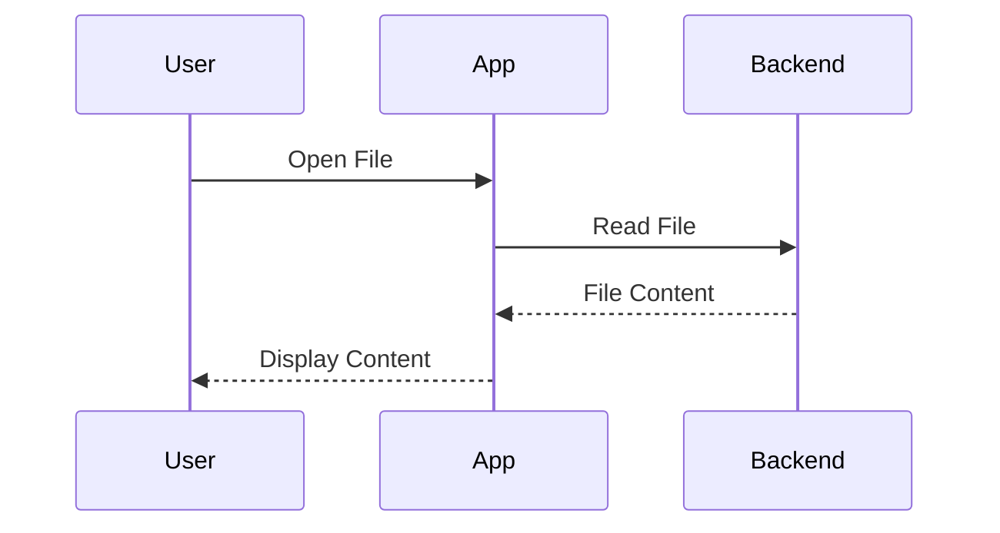
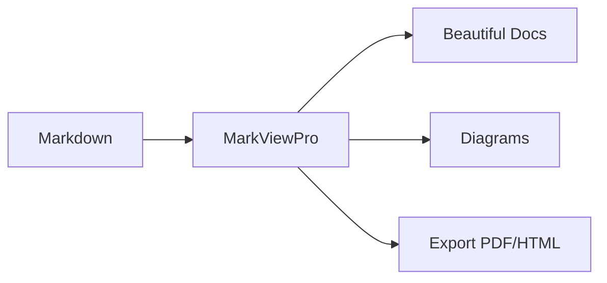
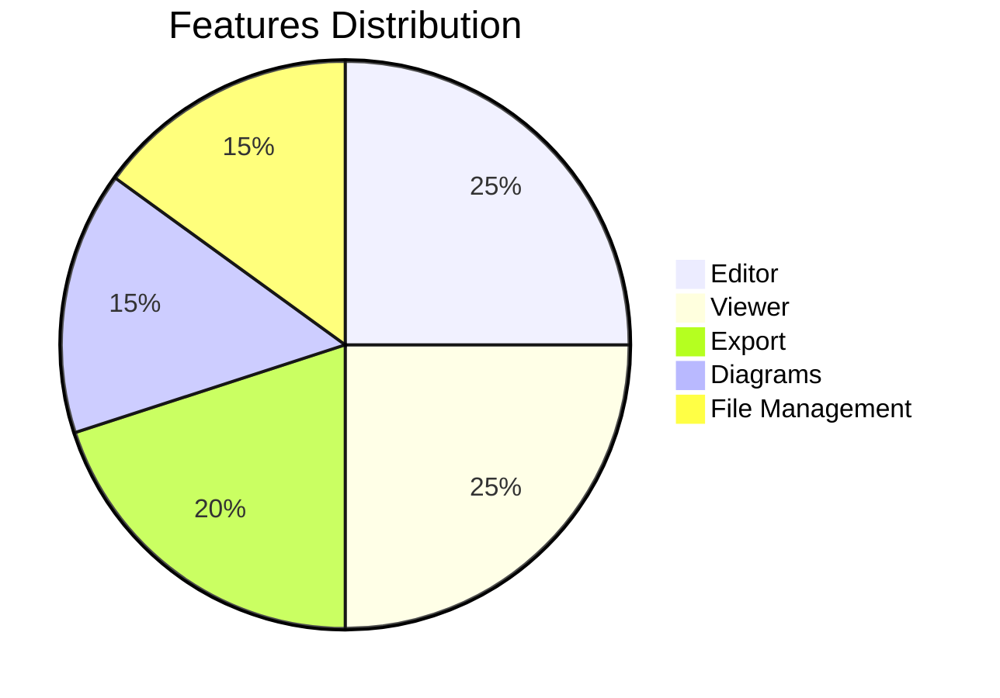
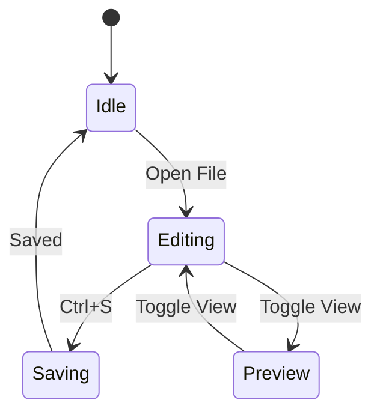

# MarkViewPro - Feature Demo

Welcome to **MarkViewPro**! This document showcases all the amazing new features we just added.

## 🎨 New Features

### 1. Split View Editor
Press `Ctrl+\` or click the view mode toggle in the top-right to switch between:
- **Preview Mode** - View rendered markdown
- **Split Mode** - Edit and preview side-by-side
- **Editor Mode** - Focus on writing

### 2. Mermaid Diagrams
Create beautiful diagrams with mermaid syntax:

### 3. Command Palette
Press `Ctrl+Shift+P` to open the command palette and quickly access:
- File operations
- View modes
- Export options
- Settings
- And more!

### 4. Folder/Project Support
Open entire folders with `Ctrl+Shift+O`:
- Browse file tree in sidebar
- Click to open files
- Navigate nested folders
- Filter markdown files automatically

### 5. Image Management
Paste or drag images directly into your document:
- **Paste**: Copy image → `Ctrl+V` in editor
- **Drag & Drop**: Drag image files into the app
- Images auto-saved to `assets/` folder
- Markdown syntax inserted automatically

## 📝 Try These Features

### Keyboard Shortcuts
| Action | Shortcut |
|--------|----------|
| Command Palette | `Ctrl+Shift+P` |
| Toggle Split View | `Ctrl+\` |
| Open Folder | `Ctrl+Shift+O` |
| Open File | `Ctrl+O` |
| Save | `Ctrl+S` |
| Search | `Ctrl+F` |
| New File | `Ctrl+N` |

### Mermaid Examples

**Flowchart:**

**Pie Chart:**

**State Diagram:**

## 🚀 What's Next?

More features coming soon:
- Git integration
- AI writing assistant
- Collaboration features
- Cloud sync
- And much more!

## 💡 Tips

1. **Split View**: Resize the split pane by dragging the divider
2. **Command Palette**: Type to fuzzy search commands
3. **File Tree**: Expands automatically when you open a folder
4. **Images**: Paste screenshots directly from clipboard
5. **Mermaid**: Supports flowcharts, sequence diagrams, pie charts, and more!

---

**Enjoy MarkViewPro!** 🎉
