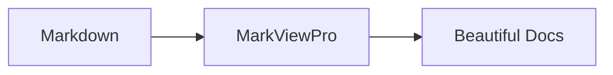

# Top 5 Features Implementation Guide

## ✅ Completed

### 1. Split View Editor
- **Component**: `frontend/src/components/SplitView/SplitView.tsx`
- **Editor**: `frontend/src/components/Editor/MarkdownEditor.tsx` (Monaco Editor)
- **Features**:
  - Resizable split pane
  - Live preview sync
  - Syntax highlighting
  - Minimap support

### 2. Mermaid Diagrams
- **Component**: `frontend/src/components/Viewer/MermaidDiagram.tsx`
- **Integration**: Updated `MarkdownViewer.tsx` to detect `mermaid` code blocks
- **Usage**: 
  ```markdown
  ```mermaid
  graph TD
    A[Start] --> B[Process]
    B --> C[End]
  ```
  ```

### 3. Command Palette
- **Component**: `frontend/src/components/CommandPalette/CommandPalette.tsx`
- **Shortcut**: Ctrl+Shift+P (needs to be wired in App.tsx)
- **Features**:
  - Fuzzy search
  - Keyboard navigation
  - Categorized commands
  - Shortcut display

### 4. Folder/Project Support
- **Backend**: `internal/foldermanager/foldermanager.go`
- **Component**: `frontend/src/components/FileTree/FileTree.tsx`
- **Features**:
  - Recursive folder scanning
  - Markdown file filtering
  - Tree navigation
  - File selection

### 5. Image Management
- **Backend**: `internal/imagemanager/imagemanager.go`
- **Features**:
  - Paste images from clipboard
  - Drag & drop images
  - Auto-save to assets folder
  - Unique filename generation

## 🔧 Integration Steps

### Step 1: Update App.tsx

Add these imports:
```typescript
import { SplitView } from './components/SplitView/SplitView';
import { ViewModeToggle, ViewMode } from './components/Toolbar/ViewModeToggle';
import { CommandPalette } from './components/CommandPalette/CommandPalette';
import { FileTree, FileNode } from './components/FileTree/FileTree';
```

Add state:
```typescript
const [viewMode, setViewMode] = useState<ViewMode>('preview');
const [commandPaletteOpen, setCommandPaletteOpen] = useState(false);
const [folderTree, setFolderTree] = useState<FileNode[]>([]);
const [currentFolder, setCurrentFolder] = useState<string | null>(null);
```

### Step 2: Add Command Palette Commands

```typescript
const commands = [
  {
    id: 'open-file',
    label: 'Open File',
    description: 'Open a markdown file',
    shortcut: 'Ctrl+O',
    action: handleOpen,
    category: 'File',
  },
  {
    id: 'open-folder',
    label: 'Open Folder',
    description: 'Open a folder as project',
    shortcut: 'Ctrl+Shift+O',
    action: handleOpenFolder,
    category: 'File',
  },
  {
    id: 'save',
    label: 'Save',
    description: 'Save current file',
    shortcut: 'Ctrl+S',
    action: handleSave,
    category: 'File',
  },
  {
    id: 'toggle-split',
    label: 'Toggle Split View',
    description: 'Switch between preview, editor, and split view',
    shortcut: 'Ctrl+\\',
    action: () => setViewMode(prev => prev === 'split' ? 'preview' : 'split'),
    category: 'View',
  },
  // Add more commands...
];
```

### Step 3: Add Image Paste Handler

```typescript
useEffect(() => {
  const handlePaste = async (e: ClipboardEvent) => {
    const items = e.clipboardData?.items;
    if (!items) return;

    for (const item of Array.from(items)) {
      if (item.type.startsWith('image/')) {
        e.preventDefault();
        const file = item.getAsFile();
        if (!file) continue;

        const reader = new FileReader();
        reader.onload = async (event) => {
          const base64Data = event.target?.result as string;
          const imagePath = await wails.savePastedImage(base64Data, filePath || '');
          if (imagePath) {
            // Insert markdown image syntax at cursor
            const imageMarkdown = `\n\n`;
            // Update content with image markdown
            onChange(content + imageMarkdown);
          }
        };
        reader.readAsDataURL(file);
      }
    }
  };

  document.addEventListener('paste', handlePaste);
  return () => document.removeEventListener('paste', handlePaste);
}, [content, filePath]);
```

### Step 4: Add Folder Open Handler

```typescript
const handleOpenFolder = async () => {
  const tree = await wails.openFolder();
  if (tree && tree.length > 0) {
    setFolderTree(tree);
    setCurrentFolder(tree[0].path);
    setSidebarOpen(true);
  }
};

const handleFileTreeClick = async (path: string) => {
  const content = await wails.readFileFromFolder(path);
  if (content) {
    addTab(path.split('/').pop() || 'Untitled', path, content);
  }
};
```

### Step 5: Update Sidebar

Add a tab for file tree in Sidebar component:
```typescript
<div className="tabs">
  <button onClick={() => setActiveTab('toc')}>TOC</button>
  <button onClick={() => setActiveTab('files')}>Files</button>
</div>

{activeTab === 'files' && (
  <FileTree 
    nodes={folderTree} 
    onFileClick={handleFileTreeClick}
    selectedPath={filePath}
  />
)}
```

### Step 6: Update Main Content Area

```typescript
<main className="flex-1 overflow-hidden relative">
  <div className="absolute top-4 right-4 z-10">
    <ViewModeToggle mode={viewMode} onChange={setViewMode} />
  </div>

  {viewMode === 'preview' && (
    <div className="h-full overflow-y-auto">
      <MarkdownViewer content={activeContent} headings={activeHeadings} />
    </div>
  )}

  {viewMode === 'editor' && (
    <div className="h-full">
      <MarkdownEditor 
        content={activeContent} 
        onChange={(newContent) => {
          // Update active tab content
        }} 
      />
    </div>
  )}

  {viewMode === 'split' && (
    <SplitView
      content={activeContent}
      onChange={(newContent) => {
        // Update active tab content
      }}
      headings={activeHeadings}
    />
  )}
</main>
```

### Step 7: Add Keyboard Shortcuts

```typescript
useEffect(() => {
  const handleKeyDown = (e: KeyboardEvent) => {
    if (e.ctrlKey && e.shiftKey && e.key === 'P') {
      e.preventDefault();
      setCommandPaletteOpen(true);
    }
    if (e.ctrlKey && e.key === '\\') {
      e.preventDefault();
      setViewMode(prev => prev === 'split' ? 'preview' : 'split');
    }
    if (e.ctrlKey && e.shiftKey && e.key === 'O') {
      e.preventDefault();
      handleOpenFolder();
    }
  };

  window.addEventListener('keydown', handleKeyDown);
  return () => window.removeEventListener('keydown', handleKeyDown);
}, []);
```

## 📦 Dependencies Installed

```json
{
  "monaco-editor": "^0.45.0",
  "@monaco-editor/react": "^4.6.0",
  "mermaid": "^10.6.1"
}
```

## 🎨 CSS Updates Needed

Add to `index.css`:
```css
.mermaid-diagram svg {
  max-width: 100%;
  height: auto;
}

.monaco-editor {
  --vscode-editor-background: #18181b;
}
```

## 🚀 Next Steps

1. Wire up all components in App.tsx
2. Add tab content management for editor mode
3. Test image paste functionality
4. Add more commands to command palette
5. Style adjustments for dark/light theme
6. Add settings for default view mode
7. Add file watcher for folder changes

## 📝 Usage Examples

### Mermaid Diagrams
````markdown

````

### Command Palette
- Press `Ctrl+Shift+P` to open
- Type to search commands
- Use arrow keys to navigate
- Press Enter to execute

### Split View
- Click "Split" button in toolbar
- Drag the divider to resize
- Edit on left, preview on right
- Real-time sync

### Folder Navigation
- File > Open Folder
- Browse file tree in sidebar
- Click files to open
- Supports nested folders

### Image Paste
- Copy image to clipboard
- Paste in editor (Ctrl+V)
- Image auto-saved to `assets/` folder
- Markdown syntax inserted automatically

