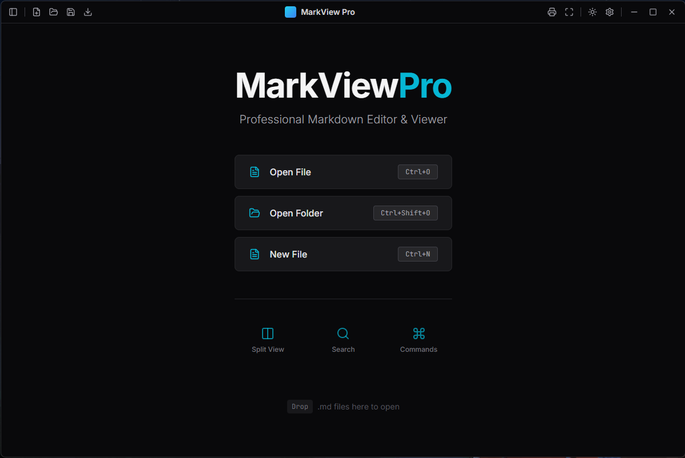
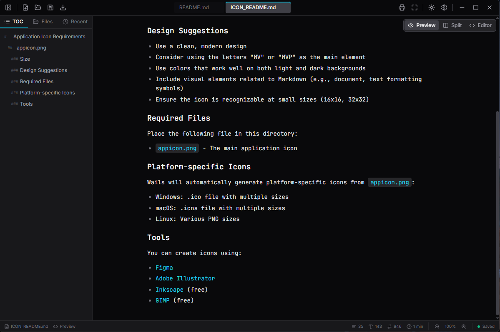
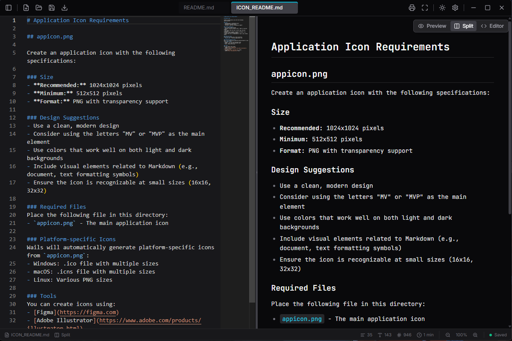

# MarkViewPro

A modern, feature-rich Markdown viewer and editor built with Wails, Go, and React. Experience blazing-fast performance with a beautiful, intuitive interface designed for productivity.

## ✨ Features

### 📝 Core Functionality
- **Multi-Tab Support** - Open and work with multiple markdown files simultaneously
- **Live Preview** - Real-time markdown rendering as you type
- **Drag & Drop** - Simply drag markdown files into the window to open them
- **Auto-Save** - Never lose your work with automatic file saving
- **File Watching** - Automatic refresh when files change externally

### 🎨 Rich Markdown Support
- **Syntax Highlighting** - Beautiful code blocks with language-specific highlighting
- **Mermaid Diagrams** - Create flowcharts, sequence diagrams, and more
- **Math Equations** - Full KaTeX support for mathematical expressions
- **Tables** - Enhanced table rendering with proper formatting
- **Task Lists** - Interactive checkboxes for todo items
- **Blockquotes & More** - Full CommonMark and GFM support

### 🔍 Advanced Features
- **Document Search** (Ctrl+F) - Find text within your documents with live highlighting
- **Table of Contents** - Auto-generated navigation from headings
- **Reading Statistics** - Word count, character count, line count, and reading time
- **Zoom Controls** (Ctrl+/Ctrl-) - Adjust text size from 50% to 200%
- **Fullscreen Mode** (F11) - Distraction-free writing and reading
- **Print Support** (Ctrl+P) - Print-optimized layouts

### 💾 Export Options
- **PDF Export** - High-quality PDF generation with preserved formatting
- **HTML Export** - Standalone HTML files with embedded styles

### 🎯 User Experience
- **Dark & Light Themes** - Beautiful themes optimized for day and night
- **Collapsible Sidebar** - Toggle table of contents and navigation
- **Keyboard Shortcuts** - Efficient workflow with comprehensive shortcuts
- **Welcome Screen** - Interactive guide showcasing all features
- **Recent Files** - Quick access to your recent documents

### 🚀 Performance
- **Native Performance** - Built with Go and Wails for desktop-class speed
- **Instant Startup** - Launch in milliseconds
- **Low Memory** - Efficient resource usage
- **Cross-Platform** - Windows, macOS, and Linux support

## 📸 Screenshots

<!-- Add screenshots here -->




## 🚀 Quick Start

### Download Pre-built Binaries

Download the latest release for your platform from the [Releases](https://github.com/OffLine911/MarkViewPro/releases) page.

### Platform-specific Instructions

**Windows:**
1. Download `MarkViewPro.exe` from releases
2. Run the installer or portable executable
3. Start viewing and editing markdown files!

**macOS:**
1. Download `MarkViewPro-macos-amd64.zip`
2. Extract and move `MarkViewPro.app` to Applications
3. Right-click and select "Open" on first launch (security requirement)

**Linux:**
1. Download `MarkViewPro-linux-amd64`
2. Make executable: `chmod +x MarkViewPro-linux-amd64`
3. Run: `./MarkViewPro-linux-amd64`

## 🛠️ Build from Source

### Prerequisites

- [Go](https://go.dev/dl/) 1.21 or later
- [Node.js](https://nodejs.org/) 18 or later
- [Wails](https://wails.io/) v2.11.0 or later

### Install Wails

```bash
go install github.com/wailsapp/wails/v2/cmd/wails@latest
```

### Clone and Build

```bash
# Clone the repository
git clone https://github.com/OffLine911/MarkViewPro.git
cd MarkViewPro

# Build for production
wails build

# The built binary will be in build/bin/
```

### Development Mode

```bash
# Run in development mode with hot reload
wails dev
```

## ⌨️ Keyboard Shortcuts

| Action | Windows/Linux | macOS |
|--------|---------------|-------|
| New File | `Ctrl+N` | `Cmd+N` |
| Open File | `Ctrl+O` | `Cmd+O` |
| Save File | `Ctrl+S` | `Cmd+S` |
| Search | `Ctrl+F` | `Cmd+F` |
| Print | `Ctrl+P` | `Cmd+P` |
| Zoom In | `Ctrl+=` | `Cmd+=` |
| Zoom Out | `Ctrl+-` | `Cmd+-` |
| Reset Zoom | `Ctrl+0` | `Cmd+0` |
| Fullscreen | `F11` | `F11` |
| Toggle Sidebar | `Ctrl+B` | `Cmd+B` |
| Settings | `Ctrl+,` | `Cmd+,` |

### Search Shortcuts (when search is open)
- `Enter` - Next match
- `Shift+Enter` - Previous match
- `↓` - Next match
- `↑` - Previous match
- `Escape` - Close search

## 🎯 Usage Tips

1. **Multiple Files**: Use tabs to work with multiple markdown files at once
2. **Quick Navigation**: Use the table of contents in the sidebar to jump to sections
3. **Search**: Press Ctrl+F to search within the current document
4. **Drag & Drop**: Drag .md or .markdown files directly into the window
5. **Export**: Use the toolbar buttons to export to PDF or HTML
6. **Zoom**: Adjust text size with Ctrl+/Ctrl- for comfortable reading

## 🏗️ Tech Stack

- **Backend**: Go with Wails framework
- **Frontend**: React 18 + TypeScript
- **Styling**: Tailwind CSS
- **Markdown**: Custom renderer with Mermaid and KaTeX support
- **Icons**: Lucide React
- **Build**: Vite

## 📦 Project Structure

```
MarkViewPro/
├── frontend/           # React frontend
│   ├── src/
│   │   ├── components/ # UI components
│   │   ├── hooks/      # Custom React hooks
│   │   ├── contexts/   # React contexts
│   │   ├── types/      # TypeScript types
│   │   └── utils/      # Utility functions
│   └── wailsjs/        # Wails bindings
├── internal/           # Go backend packages
│   ├── exporter/       # PDF/HTML export
│   ├── filemanager/    # File operations
│   ├── markdown/       # Markdown processing
│   └── settings/       # User settings
├── app.go              # Main application logic
└── main.go             # Entry point
```

## 🤝 Contributing

Contributions are welcome! Whether it's bug reports, feature requests, or code contributions, we appreciate your help in making MarkViewPro better.

### How to Contribute

1. Fork the repository
2. Create a feature branch (`git checkout -b feature/amazing-feature`)
3. Commit your changes (`git commit -m 'Add amazing feature'`)
4. Push to the branch (`git push origin feature/amazing-feature`)
5. Open a Pull Request

Please read our [Contributing Guidelines](CONTRIBUTING.md) for more details.

## 📝 Changelog

See [CHANGELOG.md](CHANGELOG.md) for a detailed history of changes.

## 📄 License

This project is licensed under the MIT License - see the [LICENSE](LICENSE) file for details.

## 🙏 Acknowledgments

- Built with [Wails](https://wails.io/) - An amazing framework for building desktop apps with Go
- Markdown rendering powered by custom React components
- Icons by [Lucide](https://lucide.dev/)
- Math rendering by [KaTeX](https://katex.org/)
- Diagrams by [Mermaid](https://mermaid.js.org/)

## 💬 Support

- 🐛 [Report a Bug](https://github.com/OffLine911/MarkViewPro/issues)
- 💡 [Request a Feature](https://github.com/OffLine911/MarkViewPro/issues)
- 📖 [Documentation](https://github.com/OffLine911/MarkViewPro/wiki)

---

Made with ❤️ by the MarkViewPro team
